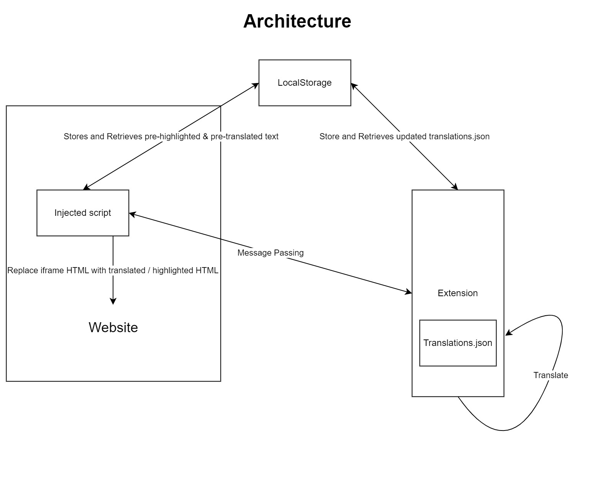

# Chrome Extension for Mailer Translation in Stripo

## Description
It is a chrome extension that can be installed on any chrome device through developer tools. It allows users to translate stripo mailers <b>in-place<b> within the stripo website with just a few clicks. There is also a handy undo button that undos to the previous version of mailer, before the most recent translation.
It also makes the developer's job more easy by allowing addition, updates and deletion on the json file that app is referring to.
Its distribution matches nicely with current deployment and distribution method. Developer just needs to export and send the translations.json / the entire app as a zip to distribution channel (eg. git).

## Current Features
1. Translates on the Stripo page directly
    - Domain
    - Dollar
    - Common keywords
2. Improved usability with few clicks
3. Autosave function
4. Undo function
5. Add,Edit and Delete keywords in translations.json
6. Add or Delete countries that needs to be added
7. Export translations.json file based on changes made in 5. and 6.

## Architecture
1. Local Storage
2. Content-Script
3. popup/combine js
4. translations.json
Above elements work together to support the app and its functionalities.

## Brief Description of how App works
Manifest defines the params, properties and files needed in the chrome extension.
Content Script is injected into the webpage through chrome extension's "scripting".
Message passing is done between Content Script and combine.js and popup.js -> pass html code around.
Local Storage is used to store global variables for all files to refer to.
Changes made in the app will store a copy of JSON on localstorage and export will export the copy on localstorage for distribution.
pre-highlight and prev-version of iframe is stored on the localstorage for 'clear' and 'undo' function respectively